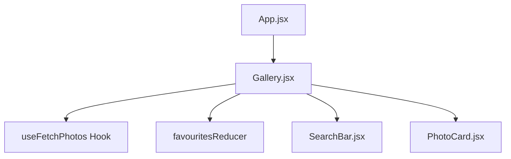
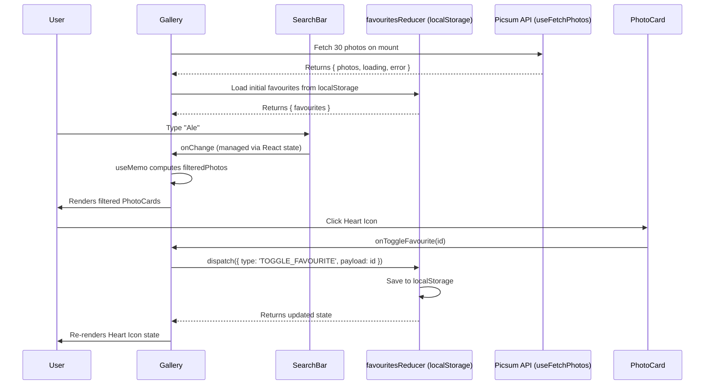

# Photo Gallery — Architecture & Technical Documentation

> **Repository:** [github.com/Shaurya-Dwivedi/Photo_Gallery_WebApp](https://github.com/Shaurya-Dwivedi/Photo_Gallery_WebApp)

## Executive Summary

This document provides a comprehensive technical overview of the **Photo Gallery** web application. Built with React 19, Vite, and Tailwind CSS v4, the application satisfies strict performance, responsiveness, and state management requirements. This guide serves as a technical reference for design decisions, data flow, and the performance optimizations applied throughout the codebase.

---

## 1. System Architecture

The application follows React's unidirectional data flow pattern, cleanly separating UI components from business logic via Custom Hooks and Reducers.

### Component Tree

### Data Flow & State Management

---

## 2. Core Components & Logic

### A. Data Fetching — `useFetchPhotos` (Custom Hook)

**Location:** `src/hooks/useFetchPhotos.js`

**Purpose:** Abstracts all network logic away from UI components, keeping the component tree clean and focused on rendering.

**Implementation Details:**
- Manages three pieces of state: `photos`, `loading`, and `error`.
- Uses `AbortController` to cancel in-flight requests if the component unmounts, preventing memory leaks.
- Implements a minimum delay via `Promise.all` with a `setTimeout` to avoid a confusing UI flash on fast networks.

---

### B. State Management — `favouritesReducer`

**Location:** `src/reducers/favouritesReducer.js`

**Purpose:** Manages the favourites list as a predictable, testable unit of logic, fully decoupled from the component lifecycle.

**Why `useReducer` instead of `useState`?**

| Factor | Explanation |
| :--- | :--- |
| **Predictability** | All state transitions are centralized in one reducer function, making it easy to trace how `favourites` changes over time |
| **Scalability** | Adding new actions (e.g., "Clear All", "Sort Favourites") is clean — just add a new action type |
| **Testability** | A pure reducer function is trivial to unit test without mounting any React component |

**Persistence:** The `saveFavourites` helper syncs state to `localStorage` directly within the reducer, ensuring data survives page reloads. All reads and writes are wrapped in `try/catch` blocks for robustness.

---

## 3. Performance Optimizations

React re-renders a component every time its state changes. Without memoization, the frequent state updates triggered by the search input would cascade into unnecessary re-renders of every child component.

### `useCallback`

**Applied to:** `handleSearchChange` & `handleToggleFavourite` in `Gallery.jsx`

- **Problem:** When `Gallery` re-renders (e.g., user types in the search bar), all functions defined inside it are recreated. Passing these newly-created function references as props to `SearchBar` and `PhotoCard` causes those children to re-render even when their own data has not changed.
- **Solution:** `useCallback` memoizes the function reference. Children receive a stable prop and do not re-render unless their dependencies change.
- **Without it:** Every keystroke in the search bar would force all 30 `PhotoCard` components to re-render, degrading typing and scrolling frame rates.

### `useMemo`

**Applied to:** `filteredPhotos` in `Gallery.jsx`

- **Problem:** The `photos.filter()` call runs on every render of `Gallery`, including renders triggered by unrelated state changes (e.g., toggling a favourite).
- **Solution:** `useMemo` caches the result of the filter operation. It only re-runs when `photos` or `searchQuery` actually change.
- **Without it:** Toggling a favourite — which has nothing to do with search — would unnecessarily re-execute the text filtering logic.

---

## 4. UI & Design Considerations

- **Responsive Grid:** Uses Tailwind's grid system (`grid-cols-1 sm:grid-cols-2 lg:grid-cols-3 xl:grid-cols-4`) to shift layout fluidly across all viewport widths.
- **Micro-interactions:** Heart icons use CSS transitions (`heart-animate` class) for a tactile feel when a photo is favourited or unfavourited.
- **Graceful Image Loading:** Images use lazy loading, and a skeleton placeholder is shown until the `onLoad` event fires from the `` tag.
- **Error & Loading States:** Managed entirely within `useFetchPhotos`, ensuring the UI always has a safe, predictable state to render.

---
